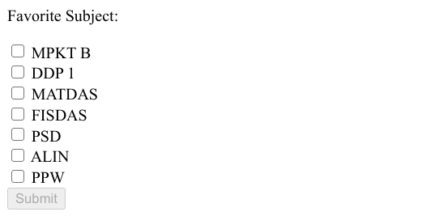
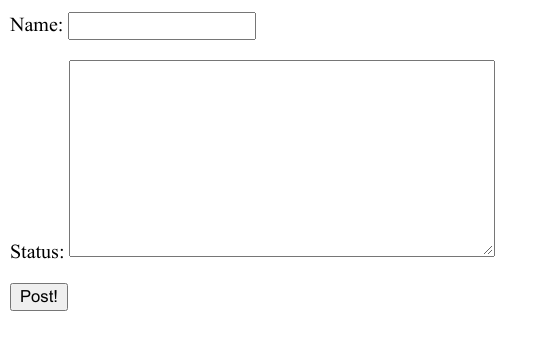
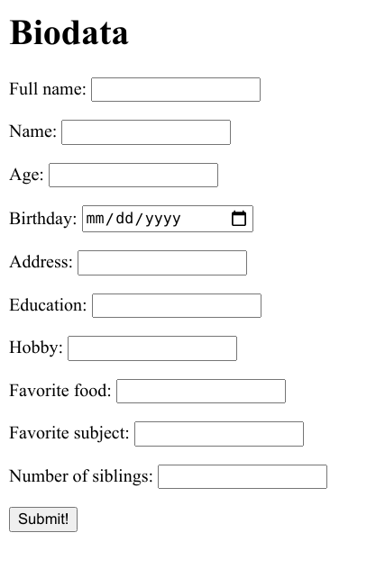

# Forms in Django 🤠

## Outline
- [Forms in Django 🤠](#forms-in-django-)
  - [Outline](#outline)
  - [Regular forms vs Django forms](#regular-forms-vs-django-forms)
  - [How-tos: **forms.Form API**](#how-tos-formsform-api)
  - [Introducing: **forms.ModelForm API**](#introducing-formsmodelform-api)
  - [Working with Form Templates](#working-with-form-templates)
  - [Each Models Field Correspondation For forms.ModelForm](#each-models-field-correspondation-for-formsmodelform)

Regular forms vs Django forms
---

Let's have a look on an example of a regular forms: **Multiple Choices using Checkboxes!**

Say you want to create a form that asks a person's favourite subjects

1. **Expected Results:**
    <br/> You want the form to be more or less like this

    


2. **HTML Code:**
    <br/> And the implementation on your html should be pretty much like this

    di template (`forms.html`):
    ```html
    <p>Favorite Subject:</p>

    <form action="#" method="post">
        <input type="checkbox" id="subject1" name="subject1" value="MPKTB">
        <label for="subject1">MPKT B</label><br>
        <input type="checkbox" id="subject2" name="subject2" value="DDP1">
        <label for="subject2">DDP 1</label><br>
        <input type="checkbox" id="subject3" name="subject3" value="MATDAS">
        <label for="subject3">MATDAS</label><br>
        <input type="checkbox" id="subject4" name="subject4" value="FISDAS">
        <label for="subject4">FISDAS</label><br>
        <input type="checkbox" id="subject5" name="subject5" value="PSD">
        <label for="subject5">PSD</label><br>
        <input type="checkbox" id="subject6" name="subject6" value="ALIN">
        <label for="subject6">ALIN</label><br>
        <input type="checkbox" id="subject7" name="subject7" value="PPW">
        <label for="subject7">PPW</label><br>

        <input type="submit" disabled="disabled">
    </form>
    ```

    Imagine having 10++ choices on the form, or you still have to add another fields in the form. Meaning that you'd have to re-do the input & label for each choices 🤮

3. **Django Forms:**
    <br/> Meanwhile if you use Django built-in form...

    di `forms.py`
    ```py
    from django import forms
    from django.forms.widgets import CheckboxSelectMultiple

    FAVORITE_SUBJECT_CHOICES = [
        ('MPKTB', 'MPKT B'),
        ('DDP1', 'DDP 1'),
        ('MATDAS', 'MATDAS'),
        ('FISDAS', 'FISDAS'),
        ('PSD', 'PSD'),
        ('PPW', 'PPW'),
        ('ALIN', 'ALIN'),
    ]

    class FavSubject(forms.Form):
        favorite_subject = forms.MultipleChoiceField(
            widget=forms.CheckboxSelectMultiple,
            choices=FAVORITE_SUBJECT_CHOICES,
        )
    ```

    <br/> di template (`forms.html`):
    ```html
    
    <form action="#" method="post">
        
        {{ form }}

        <input type="submit" disabled="disabled">
    </form>
    
    ```

How-tos: **forms.Form API**
---
This section will explain on how you could utilize Django forms API to build a simple **facebook-like timeline status form**.

**Note: only do step 1 & 2 if you haven't added the model from last week's session**

1. **Create new app**
    <br/> You know the drill, run the startapp command on your terminal (make sure you have activated your env)

    ```bash
    $ python manage.py startapp status
    ```

    Note that you can name the app however you want, but in this case i'm gonna use the name "status" (as in facebook's status 😉)

2. **Initial setup for the status app**
    <br/> This also has been done before, the pinpoints are to **add 'status' to INSTALLED_APPS on `settings.py`** and then **create and include the `urls.py` config inside the status app folder into your root `urls.py`**

    Status app `urls.py` configuration
    ```py
    from django.urls import path
    from . import views

    app_name = 'status'

    urlpatterns = [
        path('', views.status_page, name='status_page'),
    ]
    ```

    Kalo lupa bisa dicek disini yaaw https://it-force.gitlab.io/amfm/GIT.html#aplikasi-django-pertama

3. **Set-up `models.py`**
    <br/> Say we're making a form that asks name and status. So, we need to build a models class that represents the database's table.

    ```py
    from django.db import models

    # Create your models here.
    class Status(models.Model):
        name = models.CharField(max_length=55)
        status = models.TextField()
    ```

4. **Create the form on `forms.py`**
    <br/> Django doesn't have `forms.py` right out the moment you create a new app. So you have to add it manually

    ps: you can add new file on **windows** using this command
    ```bash
    $ echo. > forms.py
    ```

    or if you use **mac os/linux**
    ```bash
    $ touch forms.py
    ```

    And then, proceed to add the following lines on your `forms.py`
    ```py
    from django import forms

    class NameForm(forms.Form):
        name = forms.CharField(max_length=55)
        status = forms.CharField(widget=forms.Textarea)
    ```

5. **Implement the `views.py`**
    <br/> Add the following lines on your `views.py`

    ```py
    from django.http import HttpResponseRedirect
    from django.shortcuts import render

    # Import forms & models
    from .forms import StatusForm
    from .models import Status

    # Create your views here.
    def status_page(request):

        context={}

        if request.method == 'POST':
            form = StatusForm(request.POST)
            if form.is_valid():
                # Parse the required data from form
                # Note that you need to use "cleaned_data" in order to get cleaned data (duh)
                # To tell the differences between clean and raw form data,
                # you can do print(form) and print(form.cleaned_data)
                name = form.cleaned_data['name']
                status = form.cleaned_data['status']

                # Save the newly-posted status on our database/models
                # You can save it by creating new models object
                Status.objects.create(name=name, status=status)
                print(Status.objects.get(status=status))

                return HttpResponseRedirect('/')

        else:
            form = StatusForm()

        context["form"] = form
        context["statuses"] = Status.objects.all()

        return render(request, 'status/status.html', context)
    ```

6. **Templating (say our template file name is `status.html`)**
    <br/> First, you need to create a new html file inside the app folder. The inside of your status app directory should look as displayed below.

    ```
    ├── env
    ├── status
    │   ├── __init__.py
    │   ├── migrations
    │   ├── templates
    │   │   └── status
    │   │       └── status.html
    │   ├── admin.py
    │   ├── apps.py
    │   ├── forms.py
    │   ├── models.py
    │   ├── tests.py
    │   ├── urls.py
    │   └── views.py
    ├── manage.py
    └── amfm
        ├── __init__.py
        ├── settings.py
        ├── urls.py
        └── wsgi.py
    ```

    And then proceed to add the following lines to `status.html` file that you just created

    ```html
    
    <!DOCTYPE html>
    
    <html lang="en">
    <head>
        <meta charset="UTF-8">
        <meta name="viewport" content="width=device-width, initial-scale=1.0">
        <title>Document</title>
    </head>
    <body>
        <div>
            <form action="" method="POST">
                
                {{ form.as_p }}

                <input type="submit" value="Post!">
            </form>

            
                <h5>{{status.name}}</h5>
                <p>{{status.status}}</p>
            
        </div>
    </body>
    </html>
    
    ```
7. **Try it out!**
    <br/> It should work as of now, but don't forget to run make migrations & migrate commands since you just added a new models.

    ```bash
    $ python manage.py makemigrations
    $ python manage.py migrate
    ```

    Note: jgn lupa makemigrations dan migrate-nya di folder root!

    And finally, you can run the program and see whether the form & models are working!

    ```bash
    $ python manage.py runserver
    ```

    Voila! the look of your status page should be like this right now. Now try to fill the form and submit.
    <br/> 

    Lastly, the look of your status app is nowhere near facebook's timeline/status page (obviously heh heh). Therefore, you can add styling sebagus mungkin seperti yg suda diajarkan di minggu-minggu sebelumnya :D

    Disclaimer: Sebenarnya, kalau kalian butuh untuk bikin form yang bisa diintegrasikan dengan models/database, best practicenya adalah selalu menggunakan **forms.ModelForm**, dan bukan **forms.Form**. Penggunaan models di tutorial forms.Form hanya sebagai contoh, supaya lebih terbayang beda dan implementasi dari keduanya.

Introducing: **forms.ModelForm API**
---
As explained on the previous section, **forms.Form** allows you to build a simple form through adding a form field for each of the model fields. But imagine a case where you have a minimum ten fields on the models, and you need to make a form out of those ten models fields.

Now here's where **forms.ModelForm** comes into play. To put it simply, forms.ModelForm is an easier way to build a form when you already have a models/database to be connected with it.

Here's an example of **forms.ModelForm implementation on making a biodata form**.

**Note: The first and second steps are about the same as the `forms.Form` steps on the previous section** 

1. **Create new app**
    <br/> You know the drill, run the startapp command on your terminal (make sure you have activated your env)

    ```bash
    $ python manage.py startapp biodata
    ```

2. **Initial setup for the status app**
    <br/> This also has been done before, the pinpoints are to **add 'status' to INSTALLED_APPS on `settings.py`** and then **create and include the `urls.py` config inside the status app folder into your root `urls.py`**

    Status app `urls.py` configuration
    ```py
    from django.urls import path
    from . import views

    app_name = 'biodata'

    urlpatterns = [
        path('', views.status_page, name='status_page'),
    ]
    ```

    Kalo lupa bisa dicek disini yaaw https://it-force.gitlab.io/amfm/GIT.html#aplikasi-django-pertama

3. **Set-up `models.py`**
    <br/> Since we're making a biodata form. I want my form and models/database to be able to store as much information of the visitor/respondents as possible.

    ```py
    from django.db import models

    # Create your models here.
    class Biodata(models.Model):
        full_name = models.CharField(max_length=100)
        name = models.CharField(max_length=100)
        age = models.PositiveSmallIntegerField()
        birthday = models.DateField(auto_now=False, auto_now_add=False)
        address = models.CharField(max_length=255)
        education = models.CharField(max_length=255)
        hobby = models.CharField(max_length=255)
        favorite_food = models.CharField(max_length=255)
        favorite_subject = models.CharField(max_length=255)
        number_of_siblings = models.PositiveSmallIntegerField()
    ```

4. **Create the form on `forms.py`**
    <br/> Note: Don't forget to create a new `forms.py` inside your biodata app folder!

    ```py
    from django import forms

    from .models import Biodata

    class BiodataForm(forms.ModelForm):
        class Meta:
            model = Biodata
            fields = "__all__"
            widgets = {
                'birthday': forms.DateInput(
                    attrs={'type' : 'date'}
                ),
            }
    ```

 5. **Implement the `views.py`**
    <br/> Add the following lines on your `views.py`

    ```py
    from django.shortcuts import render, redirect

    # Import forms & models
    from .forms import BiodataForm
    from .models import Biodata

    # Create your views here.
    def biodata_page(request):

        context = {}

        if request.method == 'POST':
            form = BiodataForm(request.POST)
            if form.is_valid():
                form.save() # versi 1
                # models.Biodata(**form.cleaned_data).save() # versi 2
                return redirect('biodata:biodata_page')
        else:
            form = BiodataForm()

        context['form'] = form
        context['biodatas'] = Biodata.objects.all()

        return render(request, 'biodata/biodata.html', context)
    ```

6. **Templating (say our template file name is `biodata.html`)**
    <br/> The approach to create a new templates folder and `biodata.html` is basically the same as what's in the previous (forms.Form) section

    And the inside of your `biodata.html` should look like this

    ```html
    
    <!DOCTYPE html>
    
    <html lang="en">
    <head>
        <meta charset="UTF-8">
        <meta name="viewport" content="width=device-width, initial-scale=1.0">
        <title>Document</title>
    </head>
    <body>
        <div>
            <h1>Biodata</h1>

            <form action="" method="POST">
                
                {{ form.as_p }}

                <input type="submit" value="Submit!">
            </form>

            
                <h5>{{ 'full_name'|title }}: {{ biodata.full_name }}</h5>
                <p>{{ 'name'|title }}: {{ biodata.name }}</p>
                <p>{{ 'age'|title }}: {{ biodata.age }}</p>
                <p>{{ 'birthday'|title }}: {{ biodata.birthday }}</p>
                <p>{{ 'address'|title }}: {{ biodata.address }}</p>
                <p>{{ 'education'|title }}: {{ biodata.education }}</p>
                <p>{{ 'hobby'|title }}: {{ biodata.hobby }}</p>
                <p>{{ 'favorite_food'|title }}: {{ biodata.favorite_food }}</p>
                <p>{{ 'favorite_subject'|title }}: {{ biodata.favorite_subject }}</p>
                <p>{{ 'number_of_siblings'|title }}: {{ biodata.number_of_siblings }}</p>
            
        </div>
    </body>
    </html>
    
    ```

7. **Try it out!**
    <br/> It's the regular makemigrations -> migrate -> runserver. You should be familiar with all of these steps as of now 😉

    Your page (/biodata) should pretty much look like this. Again, it's still plain html and no css involved yet. Hence you are free to style your biodata page however you wish :D
    <br/> 

Working with Form Templates
---

*Note: The following materials are adapted from https://docs.djangoproject.com/en/3.1/topics/forms/#working-with-form-templates*

1. **Form rendering options**
    There are other output options though for the `<label>/<input>` pairs:

    * **{{ form.as_table }}** will render them as table cells wrapped in `<tr>` tags
    * **{{ form.as_p }}** will render them wrapped in `<p>` tags
    * **{{ form.as_ul }}** will render them wrapped in `<li>` tags
    Note that you’ll have to provide the surrounding `<table>` or `<ul>` elements yourself.

2. **Rendering fields manually**
    <br/> Oh, you can render your own form manually using for loops too. cool beans right!
    This allows for more flexibilty and customization towards how you would like to display your forms.

    ```py
    
    
        <div class="fieldWrapper">
            {{ field.errors }}
            {{ field.label_tag }} {{ field }}
            
            <p class="help">{{ field.help_text|safe }}</p>
            
        </div>
    
    
    ```

Each Models Field Correspondation For forms.ModelForm
---
The generated Form class will have a form field for every model field specified, in the order specified in the fields attribute.

**Each model field has a corresponding default form field**. For example, a CharField on a model is represented as a CharField on a form. A model ManyToManyField is represented as a MultipleChoiceField. Here is the full list of conversions:

|        Model field        |                                                Form field                                               |
|---------------------------|---------------------------------------------------------------------------------------------------------|
| AutoField                 | Not represented in the form                                                                             |
| BigAutoField              | Not represented in the form                                                                             |
| BigIntegerField           | IntegerField with min_value set to -9223372036854775808 and max_value set to 9223372036854775807.       |
| BinaryField               | CharField, if editable is set to True on the model field, otherwise not represented in the form.        |
| **BooleanField**          | BooleanField, or NullBooleanField if null=True.                                                         |
| **CharField**             | CharField with max_length set to the model field’s max_length and empty_value set to None if null=True. |
| **DateField**             | DateField                                                                                               |
| **DateTimeField**         | DateTimeField                                                                                           |
| DecimalField              | DecimalField                                                                                            |
| DurationField             | DurationField                                                                                           |
| **EmailField**            | EmailField                                                                                              |
| FileField                 | FileField                                                                                               |
| FilePathField             | FilePathField                                                                                           |
| FloatField                | FloatField                                                                                              |
| **ForeignKey**            | ModelChoiceField                                                                                        |
| **ImageField**            | ImageField                                                                                              |
| IntegerField              | IntegerField                                                                                            |
| IPAddressField            | IPAddressField                                                                                          |
| GenericIPAddressField     | GenericIPAddressField                                                                                   |
| JSONField                 | JSONField                                                                                               |
| **ManyToManyField**       | ModelMultipleChoiceField                                                                                |
| NullBooleanField          | NullBooleanField                                                                                        |
| PositiveBigIntegerField   | IntegerField                                                                                            |
| PositiveIntegerField      | IntegerField                                                                                            |
| PositiveSmallIntegerField | IntegerField                                                                                            |
| SlugField                 | SlugField                                                                                               |
| SmallAutoField            | Not represented in the form                                                                             |
| SmallIntegerField         | IntegerField                                                                                            |
| **TextField**             | CharField with widget=forms.Textarea                                                                    |
| **TimeField**             | TimeField                                                                                               |
| **URLField**              | URLField                                                                                                |
| UUIDField                 | UUIDField                                                                                               |

The highlighted fields are the ones you'd meet more often (relatively, based on my own humble experience)